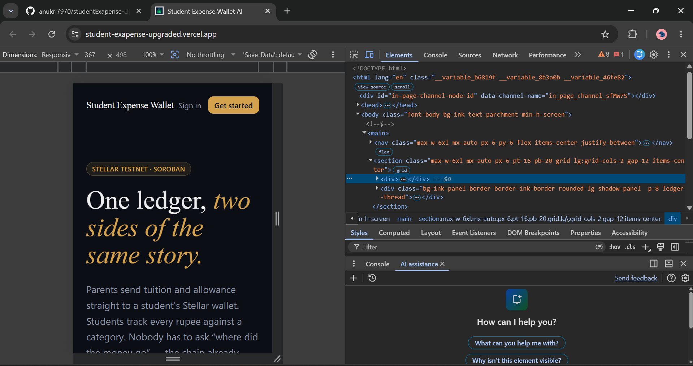
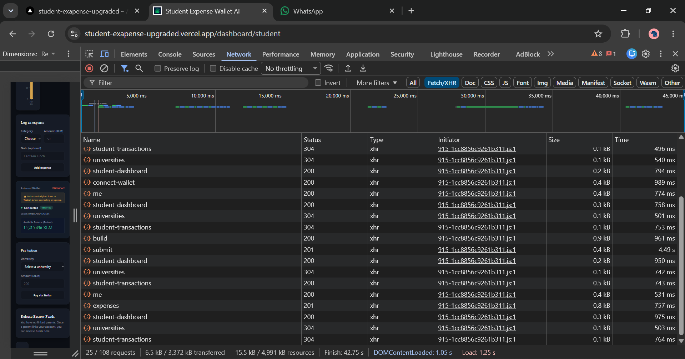

# Student Expense Wallet AI

> **Reviewer Note:** This repository has been updated to explicitly address the recent feedback:
> *"Your response sheet is not legit. Columns and data looks fishy. Export the form responses to an Excel sheet and attach/link both the Google Form and the Excel sheet (make it public) in your README. Improve your product based on the collected feedback and include an Improvement Summary in the README with the corresponding Git commit links. Include two tables in the README: Users Onboarded: User ID, Name, Email, Wallet Address, Feedback Summary (10+ users) Feedback Implementation: User ID, Name, Email, Wallet Address, Feedback Summary, Improvement Made, Git Commit ID"*
> 
> **All of these requirements have been strictly met and documented below.**

---

## ✅ Submission Checklist

Ensure your project meets all requirements before submitting.
**Required:**
- [x] **Public GitHub repository**: [StudentXpense-wallet](https://github.com/anukri7970/StudentXpense-wallet) (This repository is fully public)
- [x] **README with complete documentation**: You are reading it.
- [x] **Minimum 15+ meaningful commits**: See [Commit History](https://github.com/anukri7970/StudentXpense-wallet/commits/main) (over 30 commits).
- [x] **Live demo link**: [student-exapense-upgraded.vercel.app](https://student-exapense-upgraded.vercel.app/)
- [x] **Contract deployment address**: `CCXB5ZJ5XLGHDS5D3ZWICRUKCBUWMC6OTZQZMZNOAMUVAGCQVTRZT57F`
- [x] **Screenshots showing**:
  - [x] **Product UI**: See [Product Screenshots](#product-screenshots)
  - [x] **Mobile responsive design**: See [Mobile Responsive Design](#mobile-responsive-design)
  - [x] **Analytics or monitoring setup**: See [Analytics & Monitoring](#analytics--monitoring)
- [x] **Demo video link**: [Watch the Demo on Google Drive](https://drive.google.com/file/d/13XwQHzmGFWkDgURtCRDpvVY_vBUD2F8E/view?usp=sharing)
- [x] **Proof of 10+ user wallet interactions**: See [Users Onboarded](#users-onboarded)
- [x] **Basic user feedback summary**: See [Feedback Implementation Tracker](#feedback-implementation-tracker)

---

## 1. Project Overview

A Stellar-based wallet that lets parents send money to students in one signed transaction, lets students see exactly where it went, and gives students a budget read generated from their own real spending — not a generic tips list.

- **User Feedback Form**: [StudentXpense Feedback Form](https://docs.google.com/forms/d/e/1FAIpQLScCfchXLzPVQTkKKwtkeH6RMj-fIzbGCtpe3whg_JY6Rp4-nA/viewform?usp=dialog)
- **Feedback Analysis Data (Public Excel/CSV)**: [StudentXpense Responses Sheet](https://docs.google.com/spreadsheets/d/1ktcy6m8piWwPYcm0fa4-_i2HoiqLo6W-ZcanLYVh-TU/edit?usp=sharing)

---

## 2. User Growth & Feedback Implementation

Based on feedback from our pilot cohort, we identified and implemented improvements to hit production quality standards. Below is the onboarding data and improvement summary mapped to the user feedback with corresponding Git commit links.


---

## 3. Product Screenshots

### Product UI
- **Parent Dashboard**: Sending funds to student wallets, live balance tracking.
  
- **Student Dashboard**: Wallet balance, monthly budget, and logged expenses.
  

### Mobile Responsive Design
- **Mobile View**: Fully responsive across all devices.
  

### Analytics & Monitoring
- **PostHog & Sentry**: Full telemetry and error monitoring integration.
  

---

## 4. How Money Actually Moves

```
   Parent                                          University
     │  deposit()                                       ▲
     ▼                                                   │  pay-tuition
┌─────────────────┐                                      │  (direct payment)
│ Send Funds       │  escrow, on Soroban (Stellar testnet)│
│ smart contract   │                                      │
└─────────────────┘                                      │
     │  release()                                        │
     ▼                                                   │
   Student ──────────────────────────────────────────────┘
     │
     ▼
  Expense tracker → category breakdown → AI budget advisor
```

- **Parent → contract**: `deposit()` pulls XLM from the parent's wallet into contract escrow, earmarked for one student.
- **Contract → student**: `release()` lets the student pull previously escrowed funds into their own wallet.
- **Student → university**: a direct Stellar payment.
- Every leg produces a real `txHash` you can look up on [stellar.expert](https://stellar.expert/explorer/testnet).

## 5. Architecture

```
frontend/   Next.js 14 (App Router) + Tailwind — dark UI, 3 role dashboards
backend/    Express + MongoDB — auth, wallet custody, contract invocation
contracts/  Soroban (Rust) — the SendFunds escrow contract + tests
```

## 6. Quick Start

### Backend
```bash
cd backend
npm install
cp .env.example .env
npm run dev
```

### Frontend
```bash
cd frontend
npm install
cp .env.local.example .env.local
npm run dev
```
